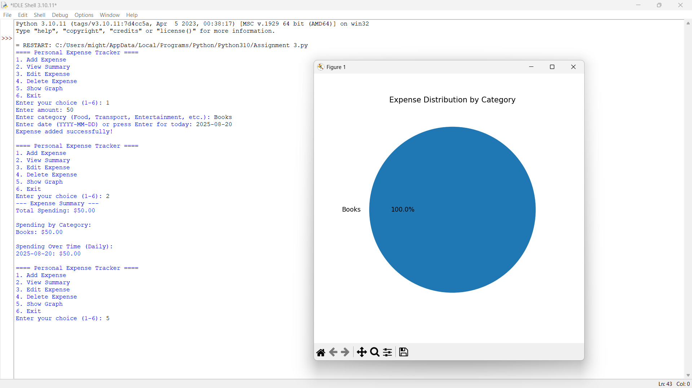
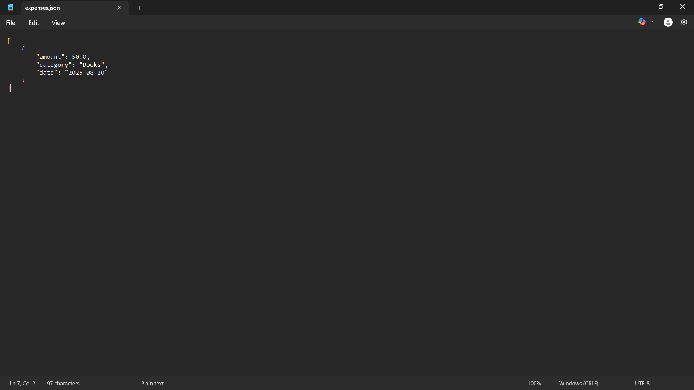

# Personal Expense Tracker

> **Mini Project — Assignment 3**  
> **Developed by:** Penugonda Manoj Mithra  
> **Email:** penugondamanojmithra@gmail.com  
> **Internship:** 1-Month Python Programming Internship at [VaultofCodes.in](https://vaultofcodes.in)  
> **Academic Context:** Developed by me at this stage of my undergraduate computer science academics to master real-world Python development, structured file handling, and graphical data analysis.

---

## 📌 Academic Context & Purpose

I developed this **Personal Expense Tracker** to solve a common, practical challenge faced by students and professionals alike: effectively tracking daily expenses, categorizing expenditures, and avoiding overspending without relying on complex, bloated financial software.

At this stage of my academics, my goal was to bridge classroom theoretical programming concepts with practical application design. By developing this project, I gained hands-on expertise in:
- Building robust data models using dictionaries and lists.
- Designing persistent file storage through JSON serialization (`json.dump` / `json.load`).
- Implementing comprehensive CRUD (Create, Read, Update, Delete) record operations.
- Processing analytical metrics (total spending, categorical spending, daily trends over time).
- Visualizing data patterns graphically using Matplotlib.

---

## ✨ Features Implemented by Me

- **Expense Logging:** Quickly log expenses with amount, category (e.g., Food, Transport, Entertainment, Academics), and automatic or custom timestamps (`YYYY-MM-DD`).
- **Persistent Data Storage:** Seamlessly reads and writes to `expenses.json`, ensuring data remains preserved across sessions.
- **Multi-Dimensional Financial Summaries:**
  - Net spending calculation.
  - Category-by-category aggregate totals.
  - Chronological daily spending breakdowns.
- **Complete CRUD Operations:** Interactive options to view existing transactions, edit existing amounts/categories/dates, and delete specific records.
- **Visual Analytics:** Generates a Matplotlib pie chart dynamically illustrating percentage expenditure per category.

---

## 🛠️ Tech Stack & Requirements

- **Language:** Python 3.8+
- **Standard Libraries:** `json`, `os`, `datetime`
- **Visualization Library:** `matplotlib`

Install dependencies:
```bash
pip install -r requirements.txt
```

---

## 🚀 How to Run

1. Navigate to this project directory:
   ```bash
   cd 01_Personal_Expense_Tracker
   ```

2. Run the script:
   ```bash
   python expense_tracker.py
   ```

3. Interact with the command-line menu (Options 1–6).

---

## 📊 My Test Execution Screenshots

Below are screenshots captured from my testing sessions during development:

### CLI Execution & Expense Analytics Plot


### Persistent Data Storage (`expenses.json`)


---

## 📂 Source File Structure

```
01_Personal_Expense_Tracker/
├── expense_tracker.py    # Main program source code developed by me
├── requirements.txt      # Dependency specifications (matplotlib)
└── README.md             # Project documentation
```
