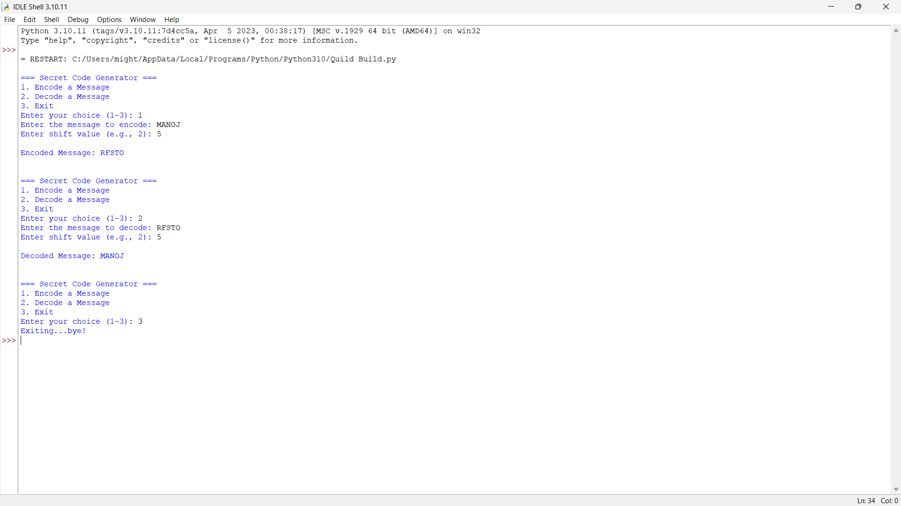

# Secret Code Generator (Caesar Cipher)

> **Quild Build Module**  
> **Developed by:** Penugonda Manoj Mithra  
> **Email:** penugondamanojmithra@gmail.com  
> **Internship:** 1-Month Python Programming Internship at [VaultofCodes.in](https://vaultofcodes.in)  
> **Academic Context:** Developed by me at this stage of my undergraduate computer science academics to explore the mathematical foundations of classical cryptography and secure data encoding.

---

## 📌 Academic Context & Purpose

I developed this **Secret Code Generator** as part of my practical curriculum during the Vault of Codes internship to gain a deeper, applied understanding of cryptographic algorithms.

At this stage of my academics, building foundational intuition around information security, character encoding tables, and modular arithmetic was a core learning goal. I designed this program to implement the **Caesar Cipher**—one of the foundational symmetric encryption algorithms in history—allowing users to convert readable plaintext into secure ciphertext and invert the transformation with mathematical precision.

Through this project, I demonstrated:
- Character-level ASCII manipulation utilizing `ord()` and `chr()`.
- Cyclic wrap-around mechanics via modular arithmetic (`% 26`).
- Preservation of original text casing (uppercase vs. lowercase) while keeping whitespace, punctuation, and numerals untouched.
- Clean terminal user interaction with robust input validation protecting against malformed shift values.

---

## 🧮 Mathematical Logic Implemented by Me

The Caesar Cipher algorithm shifts every alphabetic character by a user-defined numeric offset $n$:

- **Encryption Formula:**  
  $$E_n(x) = (x + n) \pmod{26}$$
- **Decryption Formula:**  
  $$D_n(x) = (x - n) \pmod{26}$$

Where:
- $x$ represents the 0-indexed position of a letter relative to its ASCII alphabet base (`'A'` or `'a'`).
- $n$ represents the integer shift key provided by the user.
- Any non-alphabetic symbol (such as spaces, punctuation, or numbers) is retained without modification.

---

## ✨ Features Implemented by Me

- **Bidirectional Encoding & Decoding:** Users can encode plaintext into ciphertext and reverse the transformation seamlessly.
- **Customizable Shift Key:** Accepts any positive integer shift value.
- **Strict Formatting Preservation:** Spaces, numbers, and symbols remain identical to ensure readable outputs.
- **Defensive Error Handling:** Input validation handles non-numeric shift values without program termination.
- **Zero External Dependencies:** Built with pure Python standard library built-ins for maximum portability.

---

## 🛠️ Tech Stack & Requirements

- **Language:** Python 3.x
- **Libraries:** Pure Python built-ins (`ord`, `chr`, control flow)

---

## 🚀 How to Run

1. Navigate to this project directory:
   ```bash
   cd 02_Secret_Code_Generator
   ```

2. Run the script:
   ```bash
   python secret_code_generator.py
   ```

3. Select `1` to encode a message, `2` to decode a message, or `3` to exit.

---

## 📊 My Test Execution Screenshot

Below is an execution screenshot captured from my testing of the encoding and decoding workflow:

### CLI Execution


---

## 📂 Source File Structure

```
02_Secret_Code_Generator/
├── secret_code_generator.py    # Main Caesar cipher script developed by me
└── README.md                   # Project documentation
```
